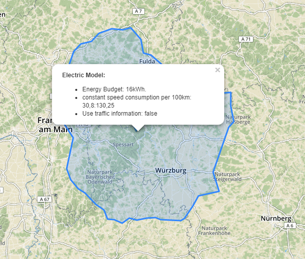

# Reachable Range

This project uses the [Reachable Range API](https://developer.tomtom.com/online-routing/online-routing-documentation-routing/calculate-reachable-range) from TomTom.
Visualizes the reachable range of an electric car with a given battery budget and consumption.

Until now, all parameters are fixed, but this might change in the future, so that you can specify alot of different parameters in the GUI.
It will support gasoline and electric car models.

## Usage
* Open the map.html file in your browser.
* You should see a map.
* Click somewhere into the map in Germany.

